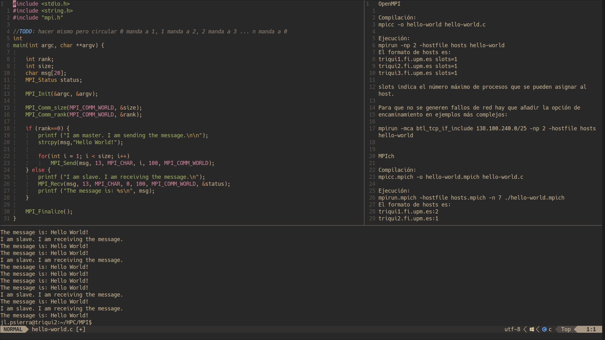

# My Custom NeoVim Setup

A personalized NeoVim configuration leveraging **LazyVim** and custom Lua functions for an optimized and efficient coding environment.

---

## Description

I have been interested in NeoVim for quite some time, and during the first semester of 2025, I fully committed to creating a setup that suits my needs.  
This configuration primarily uses the **LazyVim** plugin manager, and whenever existing plugins weren't enough, I implemented my own Lua functions to fill in the gaps.

---

## Plugins

This setup includes a variety of plugins configured to enhance productivity:

- **autopairs**: Automatically closes brackets, braces, and parentheses.
- **gruvbox-material**: Handles the editor's color scheme.
- **harpoon**: Efficiently manages open buffers for quick navigation.
- **indent-blankline**: Visualizes indentation with a custom character.
- **mason, mason-lspconfig, nvim-lspconfig**: Install and integrate LSPs for various languages.
- **nvim-dap**: Provides a visual debugging environment for multiple languages.
- **telescope**: File search with live preview.
- **treesitter**: Syntax parsing and highlighting.
- **cpm**: Autocompletion engine supporting dictionaries, snippets, and LSPs.
- **lualine**: Modern, customizable status line replacing the default one.

All plugins and keybindings have been configured to fit my workflow.

---

## Custom Functions

Two main Lua functions have been implemented:

### toggle_terminal

This function toggles a horizontal terminal window and buffer for getting in an out fast and easy.

``` lua
-- TERMINAL CONFIGURATION --

-- Variable that stores the terminal buffer (not the window)
local term_buf = nil
local term_win = nil

local function toggle_terminal()
    -- If the terminal window is still open, close it (hide it)
    if term_win and api.nvim_win_is_valid(term_win) then
        api.nvim_win_hide(term_win)
        term_win = nil
        return
    end

    -- If there is no valid terminal buffer, create it
    if not term_buf or not api.nvim_buf_is_valid(term_buf) then
        vim.cmd('botright 10split')
        vim.cmd('terminal')
        term_win = api.nvim_get_current_win()
        term_buf = api.nvim_get_current_buf()
        api.nvim_buf_set_name(term_buf, "Terminal")
    else
        -- If the buffer exists, just show it again
        vim.cmd('botright 10split')
        term_win = api.nvim_get_current_win()
        api.nvim_win_set_buf(term_win, term_buf)
    end

    vim.cmd('startinsert')
end
```

### open_naviterm

This function does almost the same as toggle_terminal but is an integration with [naviterm](https://gitlab.com/detoxify92/naviterm).

``` lua
-- NAVITERM CONFIGURATION --
local naviterm_buf = nil
local prev_buf = nil

local function open_naviterm()

    -- Get the current buffer
    local in_buf = api.nvim_get_current_buf()

    -- If the naviterm buffer exists and is valid...
    if naviterm_buf and api.nvim_buf_is_valid(naviterm_buf) then

        -- ... and it is the current buffer
        if naviterm_buf == in_buf then
            -- Switch to the previous buffer
            api.nvim_set_current_buf(prev_buf)
            return
        end

        -- ... and it is not the current buffer

        -- Update the previous buffer
        prev_buf = in_buf

        -- And switch to the naviterm buffer
        api.nvim_set_current_buf(naviterm_buf)
        return
    end

    -- If the naviterm buffer does not exist or is not valid (first iteration)

    -- Set the current buffer as the previous buffer
    prev_buf = in_buf

    -- Call naviterm, set its id in naviterm_buf, and give the buffer a name
    vim.cmd('terminal naviterm')
    naviterm_buf = api.nvim_get_current_buf()
    api.nvim_buf_set_name(naviterm_buf, "Naviterm")
end
```

## Additional features
- A custom Spanish dictionary for autocompletion, generated from the 20,000 most frequent words from the RAE corpus using a custom C program handling UTF-8 characters.

- CMP configuration shows a book icon and "Dictionary" label for dictionary suggestions, improving visual distinction between LSP and text completions.

## Screenshot


