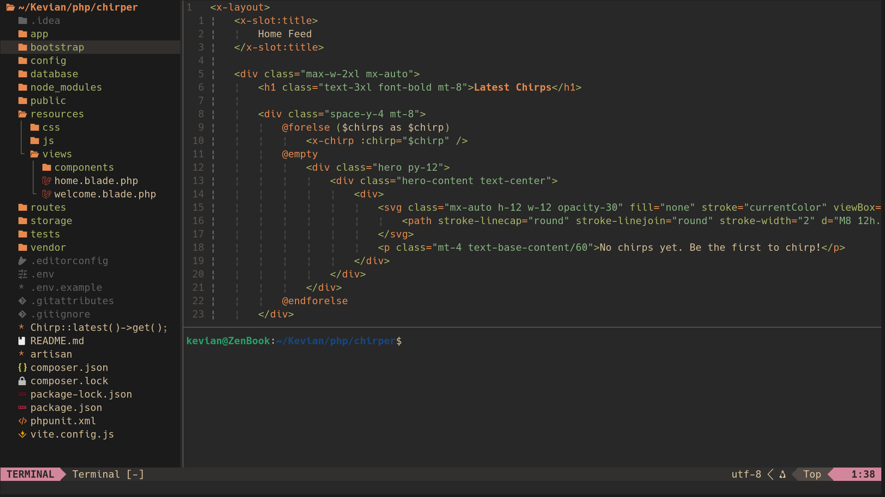

# My Custom NeoVim Setup

A personalized neovim configuration that fuses **lazyvim** and custom configurations, keybinds and functions for an optimized and efficient coding environment.

---

## Description

I have been interested in neovim for quite some time, and during the first semester of 2025, I fully committed to creating a setup that suits my needs.  
this configuration primarily uses the **lazyvim** plugin manager, and whenever existing plugins weren't enough, I implemented my own lua functions to fill in the gaps.

Comments inside files are available in spanish and english and non-commented lines are default configurations.

For instalation unzip the chosen release on your .config/nvim/ folder.

---

## Plugins

This setup includes a variety of plugins configured to enhance productivity:

- **autopairs**: automatically closes brackets, braces, and parentheses.
- **gruvbox-material**: handles the editor's color scheme.
- **harpoon**: efficiently manages open buffers for quick navigation.
- **indent-blankline**: visualizes indentation with a custom character.
- **mason, mason-lspconfig, nvim-lspconfig**: install and integrate lsps for various languages.
- **nvim-dap, nvim-dap-ui, nvim-dap-go**: provides a visual debugging environment for multiple languages (with dap-go and a ui).
- **nvim-dap-virtual-text, mason-nvim-dap**: shows inline values during debugging and lets mason install debuggers.
- **telescope**: file search with live preview.
- **treesitter**: syntax parsing and highlighting.
- **cmp (nvim-cmp)**: autocompletion engine supporting dictionaries, snippets, and lsps.
- **lualine**: modern, customizable status line replacing the default one.
- **bufferline**: tabline with open buffers, styled like a tab bar.
- **neo-tree**: file explorer with grouping of empty directories.
- **nvim-web-devicons**: filetype icons for lualine, telescope, and other plugins.
- **markdown-preview**: live preview for markdown files in the browser.
- **nvim-ts-autotag**: automatically closes and renames html-like tags.
- **vim-smoothie**: smooth scrolling for `j`, `k`, and `Ctrl-D/U`.
- **plenary**: utility library used by other plugins.

All plugins and related keybinds have been configured to fit my workflow and are present and explained in [init.lua](./init.lua) and the [plugins](./lua/plugins) folder.

---

## Custom functions

Some new functions are implemented like:

### toggle_terminal_window

This function toggles a horizontal terminal window and buffer for getting in an out fast and easy.

``` lua
local function toggle_terminal_window()
    -- Si la ventana de la terminal sigue abierta, ciérrala (ocúltala) / If the terminal window is still open, close it (hide it)
    if term_win and api.nvim_win_is_valid(term_win) then
        api.nvim_win_hide(term_win)
        term_win = nil
        return
    end

    -- Si no hay buffer de terminal válido, créalo / If there is no valid terminal buffer, create it
    if not term_buf or not api.nvim_buf_is_valid(term_buf) then
        vim.cmd('split')
        vim.cmd('resize 10')
        vim.cmd('terminal')
        term_win = api.nvim_get_current_win()
        term_buf = api.nvim_get_current_buf()
        api.nvim_buf_set_name(term_buf, "Terminal")
    else
        -- Si el buffer existe, simplemente lo volvemos a mostrar / if the buffer exists, just show it again
        vim.cmd('split')
        vim.cmd('resize 10')
        term_win = api.nvim_get_current_win()
        api.nvim_win_set_buf(term_win, term_buf)
    end

    vim.cmd('startinsert')
end
```

### open_something

This function asks for a program name and opens it in a terminal, giving the buffer a proper title.

``` lua
local function open_something()
    local cmd = vim.fn.input("Select your program: ")
    if cmd == "" then
        vim.print("")
        return
    end

    vim.cmd('terminal ' ..  cmd)
    vim.cmd('startinsert')
    local in_buf = api.nvim_get_current_buf()

    local parts = vim.split(cmd, " ")
    local title
    if #parts > 1 then
        title = parts[2]:sub(1,1):upper() .. parts[2]:sub(2)
    else
        title = parts[1]:sub(1,1):upper() .. parts[1]:sub(2)
    end
    vim.b.display_name = title
    vim.b.command = parts[1]
    vim.opt.mouse = "a"
end
```

---

## Additional features
- A custom Spanish dictionary for autocompletion, generated from the **20,000 most frequent words from the RAE corpus** using a custom C program handling UTF-8 characters.
- CMP configuration shows a book icon and "Dictionary" label for dictionary suggestions, improving visual distinction between LSP and text completions.
- A function similar to toggle_terminal_window that toggles the whole buffer instead. 
- Functions to enable and disable copilot.

---

## Screenshot

Example of real working with this setup.



